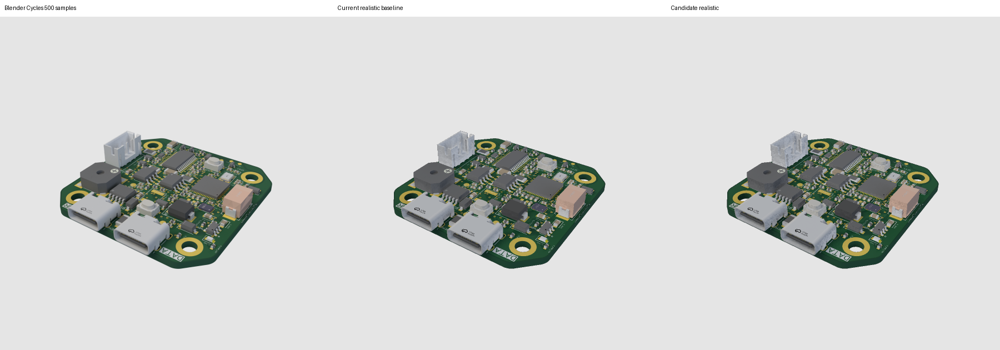
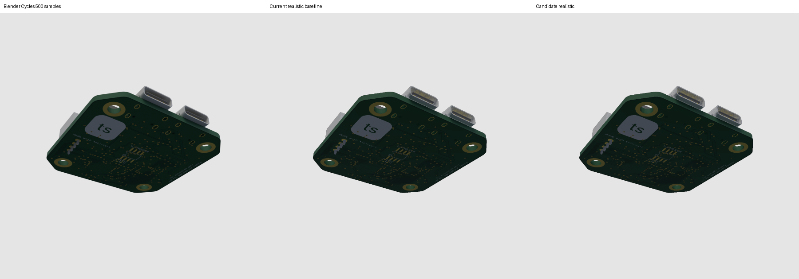
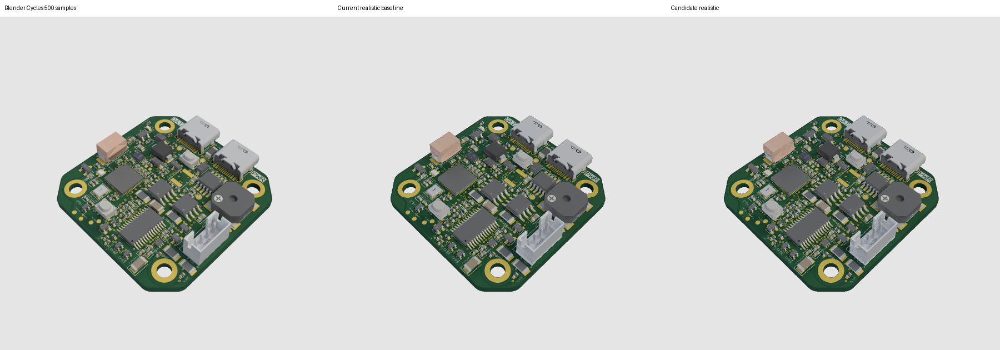

# Realistic rendering benchmark

Install dependencies with `bun install --frozen-lockfile`, then run:

```sh
./benchmark-realistic-render.sh --output benchmark-results/baseline
```

This renders the Arduino fixture, USB-C PCB, current SOIC-8, USB enclosure, and
NEMA17 from committed offline assets. Defaults are 300×300, 2× supersampling,
one warmup and three measured renders per model. File loading is excluded;
rendering, per-render setup, denoising, downsampling, and PNG encoding are timed.
Cached lighting tables are warmed up. Run without other CPU-heavy work.

Each directory contains five rendered PNGs and `results.json` with source
hashes, cameras/settings, revision/runtime, individual timings, medians, and
NEMA17 RGB MAE/RMSE against the downsampled committed Blender Cycles reference.

On a candidate renderer using the same machine/runtime/settings:

```sh
./benchmark-realistic-render.sh \
  --output benchmark-results/candidate \
  --compare benchmark-results/baseline/results.json --check
```

The check requires at least 30% lower render time, averaged equally over each
model's fractional median time reduction, and no more than a 5% relative
increase in either NEMA17 MAE or RMSE against Blender. It does not redefine 5%
as an absolute pixel-error allowance. Baseline scene/settings mismatches fail.
This is a local performance benchmark rather than a hardware-independent CI
timing test. Existing visual snapshots still guard other models' appearance.

Use `--help` for options. `--size 900` checks full-size reference parity;
`--runs 1 --warmup 0` is a quick diagnostic, not the default acceptance run.

## Recorded optimization results

The committed `benchmarks/realistic-baseline.json` and
`benchmarks/realistic-optimized.json` record runs on the same local macOS arm64
machine with Bun 1.3.2 and the defaults above. The clean renderer revisions are
`d444932` (baseline) and `f160565` (optimized). These are measured local results,
not a promise of the same speed on every machine.

| Example | Baseline median | Optimized median | Less render time |
| --- | ---: | ---: | ---: |
| Arduino Uno | 8.168 s | 4.082 s | 50.0% |
| USB-C PCB | 4.714 s | 2.047 s | 56.6% |
| SOIC-8 | 7.494 s | 2.065 s | 72.4% |
| USB enclosure | 7.139 s | 2.600 s | 63.6% |
| NEMA17 | 19.045 s | 4.816 s | 74.7% |

The equally weighted mean time reduction is **63.46%**. All five encoded PNGs
have identical SHA-256 hashes before and after optimization. NEMA17's Blender
error remains MAE **0.0323396514**, RMSE **0.0446260745**, a **0% increase** in
both metrics. `--check` passes both acceptance gates. The NEMA17 visual test also
enforces the 5% MAE/RMSE limits independently of timing hardware.

A separate full-size 900×900 NEMA17 render also matches the committed baseline
PNG byte for byte (SHA-256
`76752c23e05823f0f33628f3719cd9fe25777bf307d940784fb73ac962857e94`).
Its Blender MAE is **0.0316438247** and RMSE **0.0434921388**, unchanged from
the baseline. The full-size regular render and three-panel comparison PNG are
also byte-identical to their committed fixtures.

The optimization packs the existing SAH BVH into Float64 arrays with subtree
escape offsets, avoiding recursive traversal and repeated reciprocal direction
calculations. It preserves primitive order and computes each triangle's normal
once. Lighting reuses spherical lookup coordinates and precomputed rotation
terms, caches repeated secondary-hit irradiance, and skips diffuse rays only
when a fully metallic surface makes their contribution zero. Resolution,
supersampling, contributing lighting sample counts, materials, denoising, and
the Blender reference are unchanged. Regular rendering uses the existing path.

## RP2040 motor-controller: 500-sample Blender baseline and 2× gate

The board is [imrishabh18/rp2040-motor-controller](https://tscircuit.com/imrishabh18/rp2040-motor-controller),
release **1.0.42**, exported with its 108 CAD components and board textures through
`circuit-json-to-gltf@0.0.144` and `@resvg/resvg-js@2.6.2`. Both renderers use the
same embedded GLB (SHA-256 in `benchmarks/rp2040-motor-controller/provenance.json`).
Baseline PoppyGL is commit `b1a9728189f1311d5a9f2a527160c56f4434837e` (0.0.33).

Measured on Linux x64, Bun 1.4.2, Intel Xeon Platinum 8573C, 5 logical CPUs.
Output is 600×600 with 2× supersampling, one warmup and five measured renders
per view. Medians include each render's BVH/setup, shading, denoising, downsampling
and PNG encoding; GLB/texture loading is excluded. Cached lighting tables are
warmed; first-view warmup time is also recorded. Blender and tests were stopped
during the timing runs. These are local measured results, not hardware-independent
latency guarantees or a claim about complete cold API startup.

| View | Baseline median | Optimized median | Speedup |
| --- | ---: | ---: | ---: |
| Front | 12.521 s | 4.516 s | 2.77× |
| Back | 4.760 s | 2.243 s | 2.12× |
| Detail | 13.920 s | 5.474 s | 2.54× |

Every view passes **at least 2× speedup**. The maximum relative increase in
Blender RGB MAE or RMSE, across both foreground and whole-image checks, is
**0.59%**, below the 5% acceptance limit. Errors are measured on encoded
sRGB composited over the same gray background. Foreground uses the union of
reference, baseline, and candidate alpha masks, so empty background cannot hide
a regression. Absolute errors and per-run samples are committed as JSON.

The fresh reference uses Blender **4.3.2**, Cycles, **500 samples per internal pixel**,
adaptive sampling disabled, seed 0, eight bounces, Standard color transform and
no denoising (this Blender build lacks OIDN). It uses the same analytic studio
environment, material/geometry data, camera matrices and viewport alignment;
1200×1200 references are box-downsampled with matching integer rounding. No floor
or extra geometry is added. Baseline material limitations remain: PoppyGL does
not implement all Blender/glTF shading features.





The new renderer transforms indexed vertices once, uses binned SAH and a
widest-centroid search for small subtrees, and shades only the opaque triangles
that survive the original Float32 depth-test order. Lines, cutouts and blended
surfaces retain their rendering order. Studio shading avoids discarded diffuse
lighting calculations, caches flat-normal irradiance and roughness-dependent GGX
rotation samples, and preblends specular lookup tables in Float64 (capped at 16
roughness values per render). It uses four shadow samples per softbox, four
reflection samples and two diffuse-bounce samples, integrated by the existing
geometry-guided denoiser and supersampling. Prefiltering remains at 128 samples.
Resolution, geometry, textures, materials, denoiser and supersampling are unchanged.

Validation: **61 tests pass**, TypeScript `--noEmit` passes, and Python scripts
compile. New tests compare the optimized opaque path pixel-for-pixel with the
immediate shading path for depth ties, textures/emission, clipping, cutouts,
transparency and lines. An analytic ray test checks binned closest-hit traversal
and finite limits. Updated realistic snapshots were visually reviewed. The
existing NEMA17 512-sample Blender parity test passes its unchanged 5% bound
(MAE 0.0328553522, RMSE 0.0453221692; about 1.6% above its baseline).

### Reproduce

```sh
bun install --frozen-lockfile
mkdir -p work/board-export
bun add --cwd work/board-export circuit-json-to-gltf@0.0.144 @resvg/resvg-js@2.6.2
bun scripts/download-rp2040-board.ts board.glb work/board-export
```

Install Python `numpy` and `Pillow`, and a Blender build with Cycles. On the clean
baseline revision, copy these benchmark scripts into the checkout, then run:

```sh
bun scripts/benchmark-board.ts board.glb baseline 600 5
blender -b -t 5 --python scripts/render-board-blender.py -- board.glb baseline
python scripts/compare-board.py baseline
```

On the optimized revision, using the exact same GLB, machine and runtime:

```sh
bun scripts/benchmark-board.ts board.glb optimized 600 5
python scripts/compare-board.py baseline optimized
```

The second comparison exits nonzero if any view is below 2× or its foreground
or whole-image Blender MAE/RMSE increases by more than 5%. It also writes
side-by-side PNGs for visual review. Scene, camera, environment and runtime
mismatches are rejected. The board GLB is downloaded/exported rather than
committed; its full provenance and reference PNG hashes are recorded.
