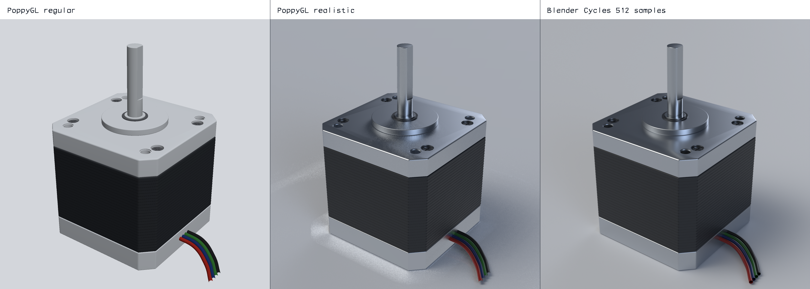

# poppygl

Render GLTF files to PNG images in completely native JavaScript without WebGL/OpenGL.



Left to right: regular PoppyGL, PoppyGL with `realistic: true`, and a Blender
Cycles reference. All three views use the same model, camera, and materials.

## Install

```sh
npm install poppygl
```

## Quick start

Give poppygl a `.gltf` or `.glb` URL and it will fetch every referenced buffer/texture, rasterize the scene, and return the PNG as a `Uint8Array`.

```ts
import { renderGLTFToPNGFromURL } from "poppygl"
import { writeFile } from "node:fs/promises"

const png = await renderGLTFToPNGFromURL(
  "https://models.babylonjs.com/DamagedHelmet.glb",
  {
    width: 800,
    height: 600,
    ambient: 0.15,
  },
)

await writeFile("DamagedHelmet.png", png)
```

> The fetch helper relies on the global `fetch` API (present in Node 18+ and modern browsers). Pass a custom `fetchImpl` if you need different transport or caching behaviour.

## Render from an in-memory GLB buffer

Already have the `.glb` bytes (for example, uploaded by a user or read from disk)? Send the buffer straight to `renderGLTFToPNGFromGLB` and receive the PNG as a `Uint8Array`.

```ts
import { readFile } from "node:fs/promises"
import { renderGLTFToPNGFromGLB } from "poppygl"

const glb = await readFile("DamagedHelmet.glb")
const png = await renderGLTFToPNGFromGLB(glb, {
  width: 1024,
  height: 768,
})

await writeFile("DamagedHelmet.png", png)
```

> This helper expects every referenced buffer/image to be embedded in the GLB (the usual single-file package). If the asset links out to external resources, load it with `renderGLTFToPNGFromURL` instead so poppygl can fetch the extras.

## Render options

### Realistic studio rendering

Pass `realistic: true` for studio lighting, metal reflections, and soft shadows.
The default is `false`, which uses the faster diffuse renderer.

```ts
import { readFile, writeFile } from "node:fs/promises"
import { renderGLTFToPNGFromGLB } from "poppygl"

const glb = await readFile("motor.glb")
const png = await renderGLTFToPNGFromGLB(glb, {
  realistic: true,
  width: 900,
  height: 900,
  supersampling: 2,
})

await writeFile("motor.png", png)
```

The same flag works with `renderGLTFToPNGFromURL`, `renderDrawCalls`, and
`renderSceneFromGLTF`. Realistic mode uses a fixed studio lighting preset;
`ambient` and `lightDir` apply to regular rendering. Camera, background, and
output settings work in both modes. A floor must be included in your model
if you want it to receive shadows.

Realistic mode supports base-color textures and scalar glTF metallic/roughness
values. Normal maps, metallic/roughness textures, and custom HDR environments
are not yet supported. Transparent and alpha-cutout surfaces do not cast shadows.

Use realistic mode for saved images. At 600×600 with 2× supersampling, the RP2040
motor-controller benchmark takes 2.26–5.49 seconds per warm render across three
views, a 2.11–2.76× speedup over the previous realistic renderer on the same
machine. Blender comparison error increases by at most 0.47%. See
[benchmark results and reproduction steps](BENCHMARK.md#rp2040-motor-controller-500-sample-blender-baseline-and-2-gate).
Render times vary with model complexity and hardware.

### Camera and background

The camera automatically frames the model unless you specify `camPos` and
`lookAt`. Set `up` to match your model's coordinate system:

```ts
const png = await renderGLTFToPNGFromGLB(glb, {
  realistic: true,
  width: 800,
  height: 600,
  camPos: [80, 60, 80],
  lookAt: [0, 0, 0],
  up: "y+",
  fov: 45,
  backgroundColor: "#e5e7eb",
  grid: false,
})
```

### Options

`renderGLTFToPNGFromURL` accepts the same render options as the lower-level APIs:

- `realistic`: enable studio lighting, reflections, and soft shadows (default `false`).
- `width`/`height`: output resolution in pixels (defaults `800`/`600`).
- `supersampling`: render at `width * supersampling` / `height * supersampling`, then downsample (default `1`).
- `fov`: vertical field of view in degrees (default `60`).
- `camPos` and `lookAt`: override the auto-framed camera position and target.
- `up`: choose the world-up axis for the camera with `"y+" | "y-" | "x+" | "x-" | "z+" | "z-"`.
- `cameraRotation`: apply Euler degrees `{ x, y, z }` to define camera orientation directly. When set, it takes precedence over `lookAt`.
- `debugPoints`: optional `{ label, position }[]` overlay rendered on top of the final PNG for world-space debugging markers.
- `debugFontSize`: optional pixel size for `debugPoints` labels; when omitted the renderer derives a size from the image dimensions.
- `debugPointColor`: optional RGB tuple for debug point markers.
- `debugLabelColor`: optional RGB tuple for debug point labels.
- `lightDir`: directional light vector for regular mode (default `[-0.4, -0.9, -0.2]`).
- `ambient`: ambient lighting contribution from 0 to 1 (default `0.15`; regular mode only).
- `gamma`: enable gamma correction (default `true`).
- `cull`: enable back-face culling (default `true`).
- `backgroundColor`: a hex string such as `"#e5e7eb"`, or an RGB tuple with values from 0 to 1.
- `grid`: show a ground grid (default `false`), or provide grid options.
- `fetchImpl`: optional override for resource loading (must match the `fetch` signature).

You can inspect the defaults via `getDefaultRenderOptions()` or reuse the internal merge logic with `resolveRenderOptions()`.

### Hidden edges for selected sub-models

Set `showHiddenEdges` in a glTF node's `extras` to render that node with solid
visible edges and faint dashed edges where its geometry is occluded:

```json
{
  "nodes": [
    { "name": "Housing", "mesh": 0 },
    {
      "name": "InternalBracket",
      "mesh": 1,
      "extras": { "showHiddenEdges": true }
    }
  ]
}
```

The namespaced form `{ "extras": { "poppygl": { "showHiddenEdges": true } } }`
is also supported. The setting can be placed on a mesh or primitive; primitive
extras take precedence over node extras, which take precedence over mesh extras.
PoppyGL derives boundary and crease edges from triangle geometry, so no line
primitives need to be added to the asset.

## If you already have the GLTF JSON

When the GLTF JSON object is already in memory (for example, bundled with your app), skip the network loader and supply resources directly:

```ts
import {
  bufferFromDataURI,
  createSceneFromGLTF,
  decodeImageFromBuffer,
  encodePNG,
  createUint8Bitmap,
  renderSceneFromGLTF,
} from "poppygl"
import gltfJson from "./CesiumMan.gltf.json" assert { type: "json" }
import { readFile } from "node:fs/promises"

const base = new URL("./CesiumMan/", import.meta.url)

const buffers = await Promise.all(
  (gltfJson.buffers ?? []).map(async (entry) => {
    if (!entry.uri) throw new Error("Buffers without URIs need custom handling.")
    return entry.uri.startsWith("data:")
      ? bufferFromDataURI(entry.uri)
      : await readFile(new URL(entry.uri, base))
  }),
)

const images = await Promise.all(
  (gltfJson.images ?? []).map(async (img) => {
    if (!img.uri) throw new Error("Only URI-backed images are shown in this example.")
    const data = img.uri.startsWith("data:")
      ? bufferFromDataURI(img.uri)
      : await readFile(new URL(img.uri, base))
    return decodeImageFromBuffer(data, img.mimeType)
  }),
)

const scene = createSceneFromGLTF(gltfJson, { buffers, images })
const { bitmap } = renderSceneFromGLTF(scene, { width: 512, height: 512 }, createUint8Bitmap)
const png = await encodePNG(bitmap)
```

The only contract is that `buffers` is an array of `Uint8Array` instances and `images` is an array of `BitmapLike` textures (PNG and JPEG are supported out of the box via `decodeImageFromBuffer`).

## Additional utilities

- `loadGLTFWithResourcesFromURL` returns `{ gltf, resources }` if you prefer to inspect or cache the parsed data before rendering.
- `createSceneFromGLTF` builds draw calls ready for the software rasterizer.
- `computeSmoothNormals` and `computeWorldAABB` expose useful preprocessing helpers.
- `createUint8Bitmap` allocates a portable in-memory bitmap used by the renderer.
- `encodePNG` packs any `BitmapLike` into a `Uint8Array` PNG that can be written to disk or served over the network.

Happy rendering!
