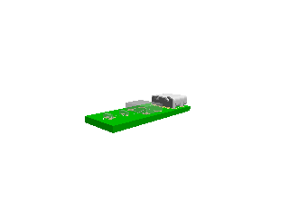

# poppygl

Render GLTF files to PNG images in completely native javascript without WebGL/OpenGL



```tsx
import { renderGLTFToPNGBuffer } from "poppygl"

const gltfPath = "./circuit.gltf" // path to your GLTF file

const pngBuffer = await renderGLTFToPNGBuffer(gltfPath, {
  width: 320,
  height: 240,
})
```
